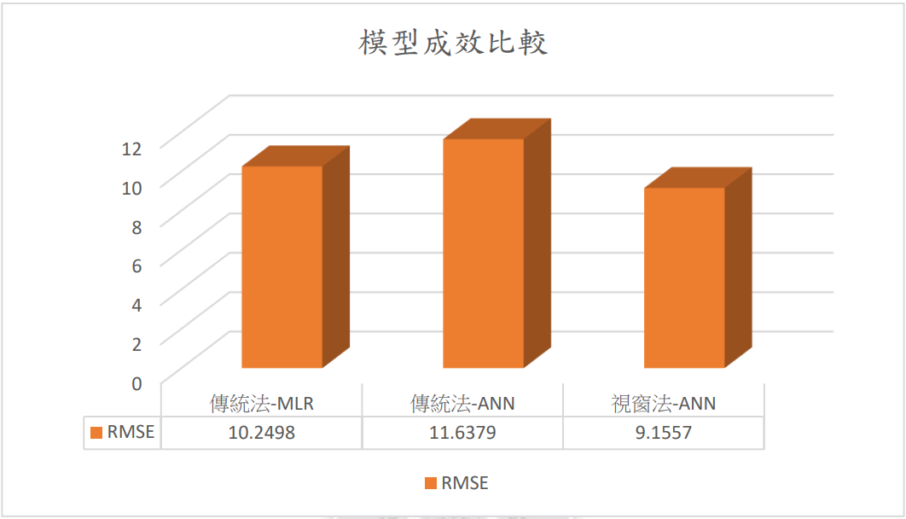

# Stock Trend Prediction with ANN 
基於財經字典與分析指標的神經網路預測股價趨勢

Predicting stock price trend using neural network based on financial lexicon and technical indicator

## 主要目的
本研究旨在使用多元線性迴歸模型 (multiple linear regression) 和人工神經網
路模型 (Artificial neural network) 預測股價，以有大量新聞的公司台積電作為研
究對象，擷取其在新聞、分析指標、歷史股價上的多方資訊。本文蒐集來自富
果網站上的財金新聞，並將財金新聞做「台積電」、「大盤相關新聞」兩大分
類，使用自製情感字典計算出兩大分類的新聞情緒分數，自製爬蟲程式蒐集台
積電的分析指標與歷史股價，最後將兩大新聞情緒分數、分析指標、歷史股價
作為預測股價的特徵。

## 主要功能
+ 抓取近5年新聞資料
+ 抓取16個分析指標
+ 抓取歷史股價
+ 運算情感分數
+ 訓練模型
+ 預測明日股價
+ 模擬投資

## 開發環境&套件
+ Windows10
+ Python 3
+ tensorflow
+ matplotlib
+ pandas
+ request
+ sklearn
+ multiprocessing

## 實驗方法

## 開始訓練模型
將package中的module從step5執行到step0
訓練出最佳模型

## 使用最佳模型預測
找出所有模型中RMSE最小的(最優模型)，套用該模型參數。
本研究針對"視窗法-ANN"找出的最佳模型參數如下圖：

## 模型成效
我們的模型在RMSE上有良好的表現，尤其視窗法-ANN的RMSE表現最佳

在準確率的表現上以視窗法-ANN 表現最佳

第一種投資策略除了傳統法-MLR 會獲
利，其餘皆是虧損；第二種投資策略（從不同的範圍中挑選出獲利最高的）皆
是獲利，但獲利皆不到9萬台幣；第三種投資策略的結果皆是獲利，尤以視窗法
-ANN 的獲利表現為全部組合中最優的，高達325,398元。

## 開發人員
+ Violet

